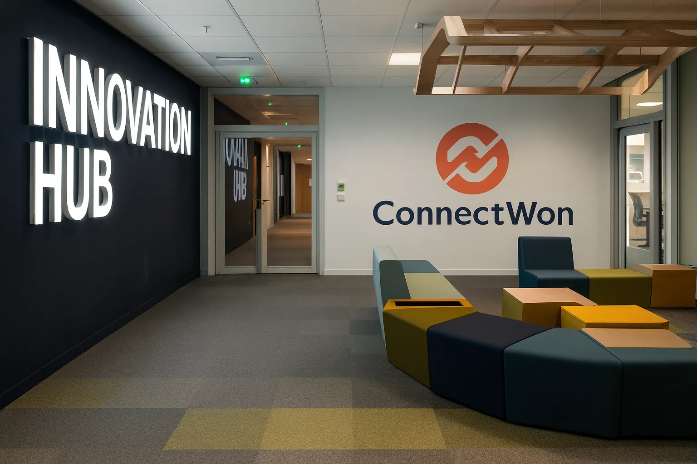

# 🚀 ConnectWon

> **도전하는 모든 이에게 공정한 기회와 지속되는 연결의 장을 제공한다.**



ConnectWon은 취업 및 창업 준비자를 위한 예약 기반 생활 서비스 플랫폼입니다. 인큐베이터형 공유 오피스 예약, AI 기반 프로그램 매칭, 멘토링 네트워크를 통해 청년들의 성장과 도전을 지원합니다.

[](https://github.com/artiordex/kosa-mvp-connectwon/actions)
[](https://opensource.org/licenses/MIT)

## 📋 프로젝트 개요

> 본 프로젝트의 목표는 MVP를 신속하게 설계·구현하여 핵심 기능과 서비스 가치를 검증하고, 이를 기반으로 향후 확장 가능한 서비스 아키텍처와 비즈니스 모델을 구체화하는 것이다.
  이를 위해 기획, 설계, 개발, 테스트, 배포 전 과정을 단일 사이클 내에서 완성하며, 실사용 환경에서의 피드백을 반영할 수 있는 프로토타입을 제작한다.

- **📌 프로젝트명**: ConnectWon (커넥트원)
- **⏳ 기간**: 2025.09.01 ~ 2025.10.10 (6주)
- **👥 팀**: 아티올덱스(Artiordex) - 민시우, 소나무
- **🎓 멘토**: 이영희 교수님 (KOSA)


### 📂 프로젝트 산출물 링크 모음

- [Notion](https://www.notion.so/your-link)
- [Google Drive](https://drive.google.com/drive/folders/your-id)
- [발표자료 PPT](https://docs.google.com/presentation/d/your-id)
- [GitHub Repo](https://github.com/artiordex/kosa-mvp-connectwon)
- [Figma](https://www.figma.com/file/your-id/your-project?type=design)
- [Mermaid ERD](https://mermaid.live/edit#pako:your-encoded-data)

- [Lucidchart](https://lucid.app/lucidchart/your-id/edit?viewport_loc=0%2C0%2C2000%2C2000)
- [Dev Docs](https://github.com/artiordex/kosa-mvp-connectwon/tree/main/docs)
---

## 🎯 핵심 가치

### 💼 비즈니스 모델

#### 🌐 하이브리드 커뮤니티 운영
- **공식 프로그램**: 플랫폼이 직접 기획 및 운영하는 창업 지원, 네트워킹, 교육 프로그램
- **회원 주도 프로그램**: 커뮤니티 회원이 자율적으로 제안하고 운영하는 워크숍, 세미나, 프로젝트
- **운영 철학**: 자율성과 연결성을 기반으로 한 커뮤니티 중심 플랫폼

#### 💰 수익 구조
- **멤버십 구독**: 월/연 단위 유료 멤버십 (혜택: 공간 할인, 프로그램 우선 참여, 포인트 지급 등)
- **공간 대여**: 회의실, 오피스, 이벤트 공간 시간 단위 대여
- **멘토링 서비스**: 전문가와의 1:1 또는 그룹 멘토링 유료 매칭
- **부가서비스**: 프린팅, 커피바, 창업 컨설팅, 법률/회계 지원 등

#### 🌱 사회적 가치
- **청년 창업 지원**: 저비용·고효율 공간과 네트워크 제공
- **지역 활성화**: 유휴 공간 활용 및 지역 커뮤니티 연계
- **지속 가능성**: 멤버십 기반 운영으로 안정적 수익 구조 확보

---

### 🧩 주요 기능 상세

#### 🏢 공유 오피스 예약 시스템
- **기능**:
  - 실시간 공간 가용성 확인 (캘린더 기반 UI)
  - 시간/공간 단위 예약 및 취소
  - 예약 내역 관리 및 알림 연동
- **기술 스택**:
  - Frontend: React + Zustand
  - Backend: NestJS + Prisma
  - Infra: PostgreSQL, Redis, n8n

#### 🤖 AI 기반 서비스
- **기능**:
  - 사용자 행동 기반 프로그램 추천 (OpenAI Embedding + 벡터 검색)
  - 콘텐츠 요약 및 자동 태깅 (GPT 기반 요약)
  - 커뮤니티 모더레이션 (비속어 필터링, 토픽 분류)
- **기술 스택**:
  - OpenAI, Anthropic, Hugging Face API
  - Zod 기반 데이터 검증
  - BullMQ로 비동기 처리

#### 💳 통합 결제 및 멤버십 관리
- **기능**:
  - Stripe 연동 결제 (카드, 포인트, 정기 구독)
  - 포인트 적립/사용 내역 관리
  - 멤버십 등급별 혜택 자동 적용
- **기술 스택**:
  - Stripe API
  - Redis 기반 포인트 캐싱
  - Prisma로 사용자-멤버십 관계 관리

#### 📱 관리자 대시보드
- **기능**:
  - 실시간 사용자 통계 (가입자 수, 예약률, 프로그램 참여율)
  - 사용자 관리 (권한, 멤버십, 활동 로그)
  - 운영 분석 리포트 (월간/분기별 KPI 시각화)
- **기술 스택**:
  - Next.js + Recharts
  - React Query + Zustand
  - Backend API: NestJS + Swagger

#### 🔔 자동화 알림 시스템
- **기능**:
  - 예약/취소/리마인더 알림 (Slack, 이메일, 앱 푸시)
  - 관리자 알림 (공간 이상 감지, 멤버십 만료 등)
  - 워크플로우 기반 예약 승인/거절 처리
- **기술 스택**:
  - n8n Workflow Engine
  - Nodemailer, Slack Webhook
  - BullMQ + Redis Queue
---

## 🛠️ 기술 스택

### 🧩 Core Technologies
| 항목              | 설명                                                                 |
|-------------------|----------------------------------------------------------------------|
| **Framework**     | Next.js 14 (App Router, Server Actions), NestJS 11                   |
| **Language**      | TypeScript, Node.js                                                  |
| **Package Manager** | pnpm                                                               |
| **Architecture**  | Monorepo (NX 기반), Domain-Driven Design                             |
| **Build Tools**   | Vite, Webpack, tsx, ts-node                                          |
---

### 🎨 Frontend

| 항목         | 설명                                                                 |
|--------------|----------------------------------------------------------------------|
| **UI**       | Tailwind CSS, shadcn/ui, class-variance-authority, lucide-react      |
| **State**    | Zustand, React Query (@tanstack/react-query)                         |
| **Form**     | react-hook-form                                                      |
| **Animation**| framer-motion                                                        |
| **Auth**     | Auth.js (Google, Naver, Kakao), next-auth                            |
| **Chart**    | Recharts                                                             |
| **Icons**    | heroicons, react-icons                                               |
| **Dropzone** | react-dropzone                                                       |
| **Color Picker** | react-color                                                     |
---

### 🧠 Backend & Database

| 항목               | 설명                                                                 |
|--------------------|----------------------------------------------------------------------|
| **Framework**       | NestJS 11                                                            |
| **Database**        | PostgreSQL, Prisma ORM                                               |
| **Cache**           | Redis (ioredis)                                                      |
| **API**             | REST (zod + @ts-rest/core), Swagger UI                              |
| **Validation**      | class-validator, zod, class-transformer                              |
| **Background Jobs** | BullMQ, Bull Board                                                   |
| **Mailing**         | nodemailer                                                           |
| **Security**        | bcryptjs, helmet, jsonwebtoken                                       |
---

### 🤖 AI & External Services

| 항목         | 설명                                                                 |
|--------------|----------------------------------------------------------------------|
| **AI APIs**  | OpenAI, Anthropic SDK, Hugging Face Inference                        |
| **Payment**  | Stripe (추후 연동 예정)                                              |
| **Notifications** | Slack Webhook, Email via nodemailer                          |
| **Automation** | n8n Workflow Engine                                                |
---

### 🚀 DevOps & Monitoring

| 항목           | 설명                                                                 |
|----------------|----------------------------------------------------------------------|
| **Deployment** | Vercel (Frontend), Docker + K8s (Backend)                            |
| **CI/CD**      | GitHub Actions, lint-staged, husky                                   |
| **Monitoring** | Sentry, Vercel Analytics                                             |
| **Logging**    | winston, logform, daily rotate file, pino                            |
| **Infra Tools**| dotenv-cli, cross-env, rimraf                                        |
---

### 🧪 Testing & Quality

| 항목               | 설명                                                                 |
|--------------------|----------------------------------------------------------------------|
| **Unit Test**       | Vitest, @vitest/ui                                                  |
| **E2E Test**        | Playwright, supertest                                               |
| **Mocking**         | MSW (Mock Service Worker)                                           |
| **Linting**         | ESLint, Prettier, typescript-eslint, eslint-plugin-unused-imports   |
| **Commit 관리**     | Changesets, Commitizen, cz-customizable                             |
| **Import 정리**     | prettier-plugin-sort-imports, simple-import-sort                    |
| **Unused 체크**     | knip                                                                |
| **Sync 관리**       | syncpack                                                            |
---

### 📦 주요 내부 패키지

| 패키지명             | 역할 및 의존성 요약                                               |
|----------------------|-------------------------------------------------------------------|
| **@connectwon/core** | 도메인 로직, BullMQ, Redis, AI API 연동, 인증/메일 등             |
| **@connectwon/database** | Prisma ORM, PostgreSQL, dotenv 연동                         |
| **@connectwon/logger** | winston 기반 로깅 시스템                                        |
| **@connectwon/api-contract** | zod 기반 API 스펙, ts-rest 연동                        |
| **@connectwon/sdk**  | 클라이언트용 API 호출 SDK                                         |
| **@connectwon/ui**   | 공통 UI 컴포넌트, Tailwind 기반 디자인 시스템                     |
| **@connectwon/server** | SSR 관련 서버 컴포넌트, React Query, Nodemailer 등             |
| **@connectwon/web**  | 메인 프론트엔드 앱, next-auth, react-hook-form 등                |
| **@connectwon/admin**| 관리자 페이지, Auth.js 기반 인증                                 |
| **@connectwon/api**  | NestJS 기반 API 서버, Swagger 문서화, BullMQ 연동                |
| **@connectwon/worker** | Bull Board UI, 백그라운드 작업 처리                            |
| **@connectwon/e2e**  | Playwright 기반 E2E 테스트                                        |
| **@connectwon/n8n**  | n8n 자동화 워크플로우 관리                                        |
---

## 🏗️ 프로젝트 구조

```
kosa-mvp-connectwon/
├── apps/
│   ├── admin/
│   ├── api/
│   ├── e2e/
│   ├── web/
│   └── worker/
├── packages/
│   ├── api-contract/
│   │   └── src/
│   │       ├── client.ts
│   │       ├── contracts/
│   │       ├── openapi/
│   │       └── schemas/
│   ├── client/
│   │   └── src/
│   │       ├── hooks/
│   │       └── providers/
│   ├── configs/
│   │   ├── eslint/
│   │   ├── tailwind/
│   │   ├── testing/
│   │   └── typescript/
│   ├── core/
│   │   └── src/
│   │       ├── adapters/
│   │       │   ├── ai/
│   │       │   └── notification/
│   │       ├── application/
│   │       │   ├── application.module.ts
│   │       │   ├── guards/
│   │       │   ├── policies/
│   │       │   └── usecases/
│   │       ├── domain/
│   │       ├── infrastructure/
│   │       ├── ports/
│   │       └── queue/
│   ├── database/
│   │   └── prisma/
│   ├── logger/
│   ├── sdk/
│   ├── server/
│   │   └── src/
│   │       ├── decorators/
│   │       ├── guards/
│   │       ├── interceptors/
│   │       ├── middleware/
│   │       ├── pipes/
│   │       ├── plugins/
│   │       └── rsc-cache.ts
│   └── ui/
│       ├── public/
│       │   ├── favicon/
│       │   ├── fonts/
│       │   ├── icons/
│       │   └── images/
│       └── src/
│           ├── animations/
│           ├── charts/
│           ├── components/
│           ├── hooks/
│           ├── layout/
│           ├── public/
│           ├── styles/
│           ├── utils/
│           └── templates/
├── infra/
│   ├── database/
│   ├── docker/
│   ├── infra-types.ts
│   ├── k8s/
│   ├── monitoring/
│   └── n8n/
├── docs/
│   ├── guideline/
│   └── study/
├── tools/
│   ├── services/
│   ├── testkit/
│   └── utils/
├── test/
├── tmp/
├── .husky/
├── .changeset/
├── .cz-config.cjs
├── .dockerignore
├── .eslintignore
├── .eslintrc.json
├── .hintrc
├── .pnpmrc
├── .prettierrc.json
├── connectwon-env.ts
├── LICENSE
├── nx.json
├── package.json
├── pnpm-lock.yaml
├── pnpm-workspace.yaml
├── PROJECT-ARCH.md
├── README.md
├── renovate.json
├── setup-structure.ps1
├── tsconfig.base.json
├── tsconfig.json
└── vitest.config.ts
```
---
### 📦 필수 설치 항목

### 🧰 시스템 도구

| 항목             | 최소 버전 | 설치 방법 |
|------------------|------------|------------|
| **Node.js**      | 18+        | [nodejs.org](https://nodejs.org) 또는 `nvm` 사용 |
| **pnpm**         | 8+         | `npm install -g pnpm` |
| **Git**          | 최신       | [git-scm.com](https://git-scm.com) |
| **Docker**       | 최신       | [Docker Desktop](https://www.docker.com/products/docker-desktop) |
| **Docker Compose** | 포함됨    | Docker 설치 시 자동 포함 |
| **VS Code**      | 최신       | [code.visualstudio.com](https://code.visualstudio.com) |
| **PowerShell / Terminal** | 최신 | Windows Terminal, zsh, bash 등 |

---

### 🗄️ 백엔드 서비스 (Docker 기반)

| 서비스       | 버전 | 실행 방법 |
|--------------|-------|-----------|
| **PostgreSQL** | 14+  | `docker-compose up -d postgres` |
| **Redis**      | 6+   | `docker-compose up -d redis` |

> `infra/docker/docker-compose.yml` 파일을 기반으로 실행됩니다.

---


### ⚙️ 개발 환경 설정 권장 사항

- **VS Code 확장 추천**:
  - ESLint
  - Prettier
  - Tailwind CSS IntelliSense
  - Prisma
  - GitLens
  - DotENV

- **터미널 환경**:
  - Windows: PowerShell 또는 Windows Terminal
  - macOS/Linux: zsh 또는 bash

## 🚀 설치 및 실행 가이드

### 1️⃣ 저장소 클론

```bash
git clone https://github.com/your-username/kosa-mvp-connectwon.git
cd kosa-mvp-connectwon
```

---

### 2️⃣ 필수 도구 설치

| 도구             | 최소 버전 | 설치 방법 |
|------------------|------------|------------|
| Node.js          | 18+        | [nodejs.org](https://nodejs.org) 또는 `nvm` 사용 |
| pnpm             | 8+         | `npm install -g pnpm` |
| Git              | 최신       | [git-scm.com](https://git-scm.com) |
| Docker & Compose | 최신       | [Docker Desktop](https://www.docker.com/products/docker-desktop) |
| VS Code          | 최신       | [code.visualstudio.com](https://code.visualstudio.com) |

> 💡 VS Code 확장 추천: ESLint, Prettier, Tailwind CSS IntelliSense, Prisma, GitLens, DotENV, NX Console

---

### 3️⃣ 의존성 설치

```bash
pnpm install
```

> 모든 앱과 패키지의 의존성이 설치됩니다. 모노레포 기반이므로 루트에서 한 번만 실행하면 됩니다.

---

### 4️⃣ 환경 변수 설정

```bash
cp .env.example .env
```

- `.env.example` 파일을 열어 다음과 같은 환경변수를 설정합니다:
  - `DATABASE_URL=postgresql://...`
  - `REDIS_URL=redis://...`
  - `NEXTAUTH_SECRET=...`
  - `STRIPE_SECRET_KEY=...`
  - 기타 서비스 키 (OpenAI, Hugging Face 등)

> 💡 `connectwon-env.ts` 파일도 참고하면 환경 변수 타입 정의를 확인할 수 있습니다.

---

### 5️⃣ 도커 기반 서비스 실행

```bash
docker-compose up -d postgres redis
```

- 도커 설정은 `infra/docker/docker-compose.yml`에 정의되어 있습니다.
- 실행 후 `localhost:5432`, `localhost:6379` 포트로 접근 가능합니다.

---

### 6️⃣ 개발 서버 실행

#### 전체 앱 실행

```bash
pnpm dev:all
```

> 모든 앱(admin, web, api, worker)이 병렬로 실행됩니다.

#### 개별 앱 실행

```bash
pnpm dev:web     # 사용자 웹 앱 (Next.js)
pnpm dev:admin   # 관리자 웹 앱
pnpm dev:api     # 백엔드 API 서버 (NestJS)
pnpm dev:worker  # 백그라운드 작업 처리 (BullMQ)
```

> 각 앱은 `apps/` 디렉토리 하위에 위치하며, 독립적으로 실행 가능합니다.

---

### 7️⃣ 테스트 실행

#### 유닛 테스트 (Vitest)

```bash
pnpm test
```

#### E2E 테스트 (Playwright)

```bash
pnpm e2e
```

> 테스트 설정은 `apps/e2e` 및 `vitest.config.ts`에 정의되어 있습니다.
---

## 🎨 주요 화면

### 사용자 앱 (Web)

- **홈페이지**: 서비스 소개 및 주요 기능
- **프로그램 목록**: AI 추천 기반 프로그램 탐색
- **예약 시스템**: 실시간 캘린더 기반 예약
- **마이페이지**: 예약 내역, 포인트 관리, 프로필

### 관리자 앱 (Admin)

- **대시보드**: 실시간 통계 및 주요 지표
- **사용자 관리**: 회원 정보 및 멤버십 관리
- **공간 관리**: 지점/룸 관리 및 가용성 설정
- **프로그램 관리**: 프로그램/세션 관리

## 🔍 벤치마킹 및 참고 자료

프로젝트 개발에 참고한 주요 서비스들:

#### 공간 예약 플랫폼

- **[Shareit](https://www.shareit.kr)**: 소규모 공간 예약 모델, 검색 필터 및 카테고리 UX
- **[SpaceCloud](https://spacecloud.kr)**: 프로그램 모집, 검색 필터, 카테고리 구조

#### 코워킹 스페이스

- **[WeWork](https://www.wework.com/ko-KR)**: 글로벌 코워킹 운영 및 커뮤니티 라운지 모델
- **[SparkPlus](https://sparkplus.co)**: 국내 지점 운영 및 스타트업 중심 이벤트
- **[FastFive](https://www.fastfive.co.kr)**: 스타트업 중심 코워킹 환경
- **[Industrious](https://www.industriousoffice.com)**: 프리미엄 오피스 및 호스피털리티 중심 생산성 공간

#### 스타트업 지원형 공간

- **[DreamPlus](https://www.dreamplus.io)**: 스타트업 지원형 공간 및 프로그램 연계
- **[Orange Planet](https://orangeplanet.or.kr/)**: 창업 커뮤니티 및 지원 프로그램 통합
- **[ICT CoC](https://ictcoc.kr/)**: ICT SW 프로그램 및 공간제공

#### 공공/커뮤니티 서비스

- **[서울청년포털](https://youth.seoul.go.kr)**: 공공 청년 라운지 및 정책 연계
- **[스마트플레이스](https://www.smartplace.kr)**: 리뷰 기반 O2O 운영 모델

#### 가치혁신 및 커뮤니티

- **[Impact Hub](https://www.impacthub.net)**: 기업/공공/스타트업/투자자 간 협력 플랫폼
- **[MOSF 블로그](https://blog.mosf.kr)**: 공간 플랫폼 기획 및 공간의 의미 탐구

### 💡 차별화 포인트

위 서비스들과 차별화되는 ConnectWon만의 특징:

- **하이브리드 커뮤니티**: 공식 프로그램 + 회원 주도 프로그램 공존
- **AI 기반 개인화**: OpenAI/Anthropic을 활용한 프로그램 매칭 및 콘텐츠 생성
- **사회적 가치 중심**: 취창업 준비자 특화 저비용 고효율 서비스
- **통합 자동화**: n8n 기반 예약부터 결제, 알림까지 end-to-end 자동화

### 🔧 참고자료
#### 언어 & 프레임워크
- [Next.js](https://nextjs.org/docs)
- [NestJS](https://docs.nestjs.com/)
- [TypeScript](https://www.typescriptlang.org/docs/)
- [React](https://react.dev/learn)
- [Node.js](https://nodejs.org/en/docs)

#### 인증 & 보안
- [NextAuth.js](https://next-auth.js.org/getting-started/introduction)
- [jsonwebtoken](https://github.com/auth0/node-jsonwebtoken#readme)
- [bcryptjs](https://github.com/dcodeIO/bcrypt.js#readme)
- [helmet](https://helmetjs.github.io/)

#### 데이터베이스 & ORM
- [Prisma](https://www.prisma.io/docs)
- [@prisma/client](https://www.prisma.io/docs/reference/api-reference/prisma-client-reference)
- [class-validator](https://github.com/typestack/class-validator#readme)
- [class-transformer](https://github.com/typestack/class-transformer#readme)
- [Zod](https://zod.dev/)

#### API & 문서화
- [Swagger UI Express](https://github.com/scottie1984/swagger-ui-express#readme)
- [@nestjs/swagger](https://docs.nestjs.com/openapi/introduction)
- [OpenAPI Types](https://github.com/OAI/OpenAPI-Specification)

#### 메시징 & 큐
- [BullMQ](https://docs.bullmq.io/)
- [@nestjs/bullmq](https://docs.nestjs.com/techniques/queues)
- [ioredis](https://github.com/redis/ioredis#readme)
- [@bull-board/ui](https://github.com/felixmosh/bull-board#readme)

#### 테스트 & 품질
- [Playwright](https://playwright.dev/)
- [Vitest](https://vitest.dev/)
- [Testing Library - React](https://testing-library.com/docs/react-testing-library/intro/)
- [MSW(Mock Service Worker)](https://mswjs.io/)
- [Supertest](https://github.com/ladjs/supertest#readme)

#### 상태관리 & 데이터 패칭
- [TanStack Query (React Query)](https://tanstack.com/query/latest)
- [RxJS](https://rxjs.dev/)

#### UI & 스타일링
- [Tailwind CSS](https://tailwindcss.com/docs)
- [PostCSS](https://postcss.org/docs/)
- [Autoprefixer](https://github.com/postcss/autoprefixer#readme)
- [Framer Motion](https://www.framer.com/motion/)
- [React Hook Form](https://react-hook-form.com/)
- [React Dropzone](https://react-dropzone.js.org/)
- [React Color](https://casesandberg.github.io/react-color/)
- [Heroicons](https://heroicons.com/)
- [Lucide React](https://lucide.dev/guide/packages/lucide-react)
- [Recharts](https://recharts.org/)
- [Class Variance Authority](https://cva.style/docs)
- [Tailwind Merge](https://www.npmjs.com/package/tailwind-merge)
- [Fontsource Inter](https://fontsource.org/fonts/inter)
- [Fontsource Poppins](https://fontsource.org/fonts/poppins)
- [React Icons](https://react-icons.github.io/react-icons/)

#### 로깅 & 모니터링
- [Winston](https://github.com/winstonjs/winston#readme)
- [winston-daily-rotate-file](https://www.npmjs.com/package/winston-daily-rotate-file)
- [Morgan](https://github.com/expressjs/morgan#readme)

#### 서버 & 네트워크
- [Express](https://expressjs.com/)
- [CORS](https://github.com/expressjs/cors#readme)
- [dotenv](https://github.com/motdotla/dotenv#readme)
- [dotenv-cli](https://github.com/entropitor/dotenv-cli#readme)
- [Reflect Metadata](https://rbuckton.github.io/reflect-metadata/)

#### 빌드 & 번들링
- [Vite](https://vitejs.dev/)
- [Webpack](https://webpack.js.org/)
- [Nx](https://nx.dev/)
- [ts-node](https://typestrong.org/ts-node/)
- [tsx](https://github.com/esbuild-kit/tsx#readme)

#### 코드 품질 & 린팅
- [ESLint](https://eslint.org/docs/latest/)
- [Prettier](https://prettier.io/docs/en/)
- [eslint-config-next](https://nextjs.org/docs/basic-features/eslint)
- [eslint-config-prettier](https://github.com/prettier/eslint-config-prettier#readme)
- [eslint-plugin-import](https://github.com/import-js/eslint-plugin-import#readme)
- [eslint-plugin-prettier](https://github.com/prettier/eslint-plugin-prettier#readme)
- [eslint-plugin-simple-import-sort](https://github.com/lydell/eslint-plugin-simple-import-sort#readme)
- [eslint-plugin-unused-imports](https://github.com/sweepline/eslint-plugin-unused-imports#readme)

#### 자동화 & 배포
- [Husky](https://typicode.github.io/husky/)
- [Lint-Staged](https://github.com/okonet/lint-staged#readme)
- [Renovate](https://docs.renovatebot.com/)
- [Changesets](https://github.com/changesets/changesets#readme)
- [Commitizen](https://commitizen-tools.github.io/commitizen/)
- [cz-customizable](https://github.com/leoforfree/cz-customizable#readme)
- [npm-run-all](https://github.com/mysticatea/npm-run-all#readme)
- [Concurrently](https://github.com/open-cli-tools/concurrently#readme)

#### AI & 외부 API
- [OpenAI Node SDK](https://github.com/openai/openai-node#readme)
- [Anthropic AI SDK](https://github.com/anthropics/anthropic-sdk-typescript#readme)
- [Hugging Face Inference API](https://huggingface.co/docs/api-inference/index)
- [Stripe API](https://stripe.com/docs/api)
- [Public API 정리](https://github.com/yybmion/public-apis-4Kr)

#### 워크플로우 자동화
- [n8n](https://n8n.io/docs)

#### 기타 유틸리티
- [Axios](https://axios-http.com/docs/intro)
- [Day.js](https://day.js.org/)
- [clsx](https://github.com/lukeed/clsx#readme)
- [js-yaml](https://github.com/nodeca/js-yaml#readme)
- [rimraf](https://github.com/isaacs/rimraf#readme)
- [syncpack](https://github.com/JamieMason/syncpack#readme)
- [knip](https://knip.dev/)
---

## 📌 MVP 개발 일정 (6주)

#### Week 1-2: 기획 및 기반 구축

**1. 비즈니스 모델 검증**
- 타겟 고객 페르소나 정의 및 주요 시나리오 도출
- 경쟁 서비스 벤치마킹(국내·외 예약 플랫폼, 공유오피스, 멘토링 서비스)
- 수익 모델 및 확장성 분석 (멤버십, 공간 대여, 부가 서비스)
- 예약·취소·환불·노쇼 정책 초안 수립

**2. 인프라 및 개발 환경 구축**
- Vercel 기반 프론트/백엔드 통합 배포 환경 세팅
- Supabase/Neon PostgreSQL DB 인스턴스 생성 및 연결
- Docker/Compose 표준화, GitHub Actions CI/CD 파이프라인 구성
- 환경 분리(dev/staging/prod) 및 GitHub Environments 기반 시크릿 관리
- Redis 설치 및 세션/캐시/대기열 처리 구조 마련
- Sentry, Vercel Analytics, pino 로깅 등 모니터링 툴 연동

**3. ERD 설계 및 DB 구축**
- 서비스 핵심 테이블(users, venues, rooms, programs, sessions, reservations, payments, ai_interactions) 설계
- Prisma 스키마 정의 및 마이그레이션 실행
- 초기 시딩 데이터 생성(지점, 회원, 프로그램, 예약, 결제 샘플)
- 인덱스 전략 수립(FK, 시간대별 조회, 예약 중복 방지)

**4. 기본 UI/UX 설계**
- IA(Information Architecture) 및 사용자 플로우 작성
- Figma를 활용한 웹/모바일 와이어프레임 제작
- 예약 캘린더, 결제 플로우, 로그인 화면 등 핵심 화면 시안
- 에러·예외 UX 설계(슬롯 충돌, 결제 실패, 취소 처리)

**5. 프로젝트 아키텍처 구성**
- Monorepo(Nx) 기반 프로젝트 구조 생성
- Next.js 14(App Router, Server Actions) + TypeScript 초기 세팅
- 공통 컴포넌트/레이아웃/스타일 시스템(Tailwind CSS, shadcn/ui) 구축
- API 명세서(zod-openapi) 초안 작성

---

#### Week 3-4: 핵심 기능 개발

**1. 사용자 인증 시스템**
- Auth.js 기반 소셜 로그인(Google/Naver/Kakao)
- JWT + 세션 하이브리드 인증 구조
- 권한(Role) 기반 접근 제어(User/Creator/Admin)
- 프로필 관리 및 예약 내역 조회 기능

**2. 예약 시스템 구현**
- FullCalendar 기반 예약 UI
- 가용 슬롯 계산, 동시성 제어, 중복·이중 예약 방지 로직
- 예약 정책(최소/최대 시간, 마감, 블랙아웃) 적용
- 대기열 엔진 구현(취소 시 자동 할당)

**3. 결제 시스템 연동**
- Stripe 결제 플로우 구현(카드 결제, 구독 결제)
- 환불/취소 처리 로직
- 결제 내역 관리 및 이메일 영수증 발송

**4. AI 서비스 통합**
- OpenAI API 연동(프로그램 요약, 태깅)
- Anthropic/Hugging Face API PoC(모더레이션, 분석)
- AI 호출 로그(ai_interactions) 저장 및 추천 알고리즘 기초 구현

---

#### Week 5-6: 완성 및 최적화

**1. 관리자 대시보드**
- 사용자/공간/프로그램/세션/예약 CRUD
- 통계 시각화(예약 수, 매출, 가동률, 노쇼율)
- 실시간 모니터링 및 알림

**2. 자동화 시스템 구축**
- n8n 워크플로우 구성(예약/변경/취소/환불 알림)
- 후기 요청, 미이용 리마인더, 정산 리포트 자동 발송
- 야간 배치 작업(만료 예약 정리)

**3. 테스트 및 QA**
- Vitest 단위 테스트(핵심 API)
- Playwright E2E 테스트(예약→결제→알림 플로우)
- 사용자 시나리오 기반 QA 및 버그 수정

**4. 성능 최적화**
- DB 인덱스 최적화 및 Redis 캐시 적용
- 이미지 최적화 및 CDN 적용
- 코드 스플리팅, 불필요 렌더링 최소화
- 보안 강화(zod 검증, 환경변수 키 관리, 로그 마스킹)

---
## 🤝 기여하기

1. 이 저장소를 포크합니다
2. 기능 브랜치를 생성합니다 (`git checkout -b feature/amazing-feature`)
3. 변경사항을 커밋합니다 (`git commit -m 'Add some amazing feature'`)
4. 브랜치에 푸시합니다 (`git push origin feature/amazing-feature`)
5. Pull Request를 생성합니다

## 📄 라이선스

이 프로젝트는 MIT 라이선스 하에 배포됩니다. 자세한 내용은 [LICENSE](LICENSE) 파일을 참조하세요.

## 📞 문의

- **총괄개발**: 민시우 - [artiordex@gmail.com](mailto:artiordex@gmail.com)
- **총괄기획**: 소나무 - [snmaterial13@naver.com](mailto:snmaterial13@naver.com)
- **멘토**: 이영희 교수님 - KOSA 한국소프트웨어산업협회

## 🙏 감사의 말

이 프로젝트는 KOSA(한국소프트웨어산업협회)의 지원을 받아 개발되었습니다. 멘토링을 제공해주신 이영희 교수님과 모든 관계자분들께 감사드립니다.

---
**ConnectWon** - 도전하는 모든 이에게 공정한 기회와 지속되는 연결의 장을 제공합니다. 💪
